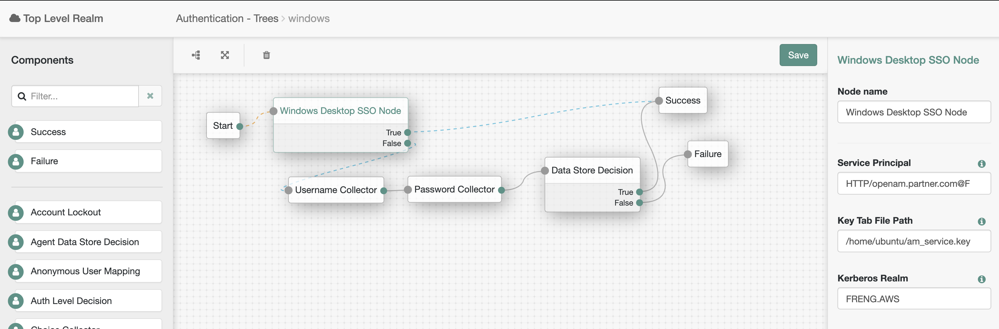

<!--
 * The contents of this file are subject to the terms of the Common Development and
 * Distribution License (the License). You may not use this file except in compliance with the
 * License.
 *
 * You can obtain a copy of the License at legal/CDDLv1.0.txt. See the License for the
 * specific language governing permission and limitations under the License.
 *
 * When distributing Covered Software, include this CDDL Header Notice in each file and include
 * the License file at legal/CDDLv1.0.txt. If applicable, add the following below the CDDL
 * Header, with the fields enclosed by brackets [] replaced by your own identifying
 * information: "Portions copyright [year] [name of copyright owner]".
 *
 * Copyright 2019 ForgeRock AS.
-->
# Windows Desktop SSO Node

A Windows Desktop SSO authentication node for ForgeRock's Identity Platform 6.5.2 and above. The Windows
Desktop SSO node uses Kerberos authentication. The user presents a Kerberos token to AM through the Simple and
Protected GSS-API Negotiation Mechanism (SPNEGO) protocol. The Windows Desktop SSO authentication node enables
desktop single sign on such that a user who has already authenticated with a Kerberos Key Distribution Center can
authenticate to AM without having to provide the login information again. Users might need to set up Integrated 
Windows Authentication in Internet Explorer or Microsoft Edge to benefit from single sign on when logged on to a
Windows desktop.


## Usage

To deploy this noded, download the jar from the releases tab on github 
[here](https://github.com/FrankGasparovic/Windows-Desktop-SSO-Node/releases/latest). Next, copy the jar into the 
../web-container/webapps/openam/WEB-INF/lib directory where AM is deployed. Restart the web container to pick up the 
new node. The node will then appear in the authentication trees components palette.

### Windows Desktop SSO Node Configuration
* **Service Principal** - The name of the Kerberos principal used during authentication. The format of the field is
 as follows: ```HTTP/openam.forgerock.com@AD_DOMAIN.COM```
* **Key Tab File Path** - The absolute pathname of the AD keytab file.
* **Kerberos Realm** - The name of the Kerberos (Active Directory) realm used for authentication.
* **Kerberos Server Name** - The hostname/IP address of the Kerberos (Active Directory) server.
* **Trusted Kerberos realms** - List of Trusted Kerberos Realms for User Kerberos tickets.
* **Return Principal with Domain Name** - Returns the fully qualified name of the authenticated user rather than just the username.
* **Lookup User In Realm** - Validate that the user has a matched user profile configured in the data store.
* **Is Initiator** - True, if initiator. False, if acceptor only. Default is True.

        
### Example Flow

This flow will attempt to authenticate the user via Windows Desktop SSO. If unsuccessful, AM will request the
 username and password for login.
 
  
